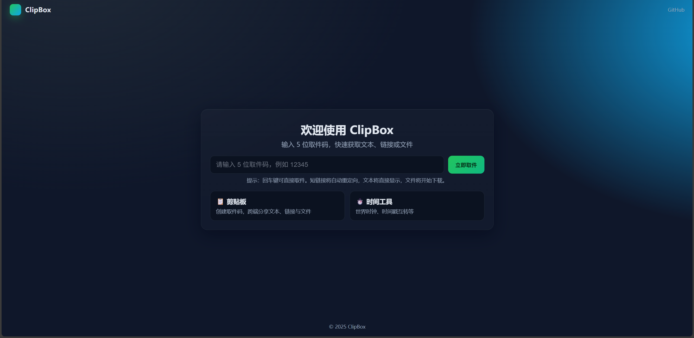
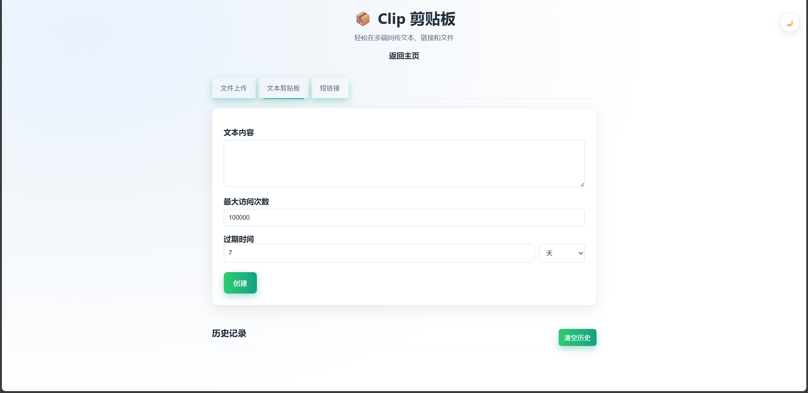
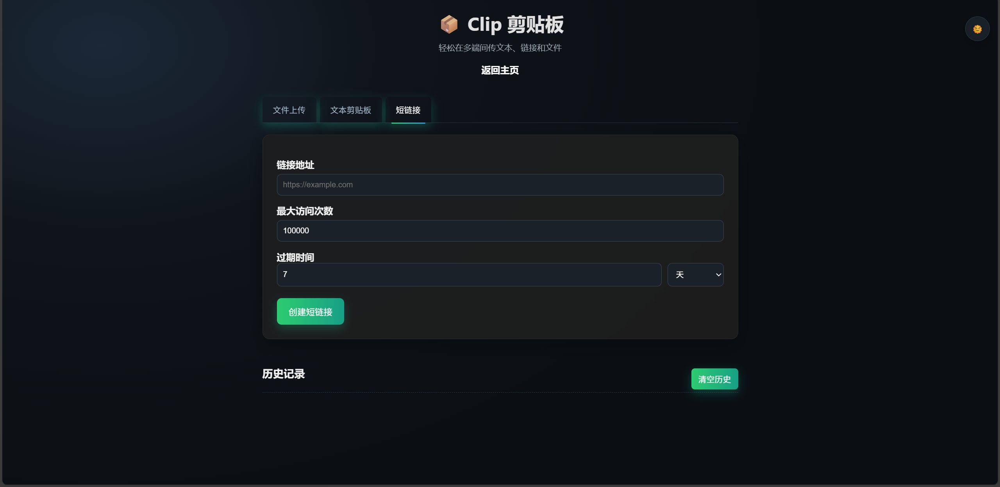
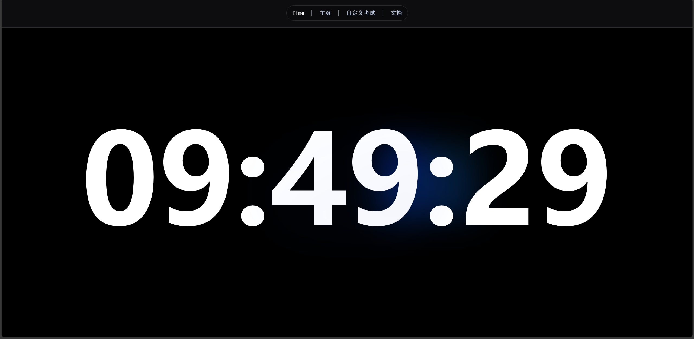
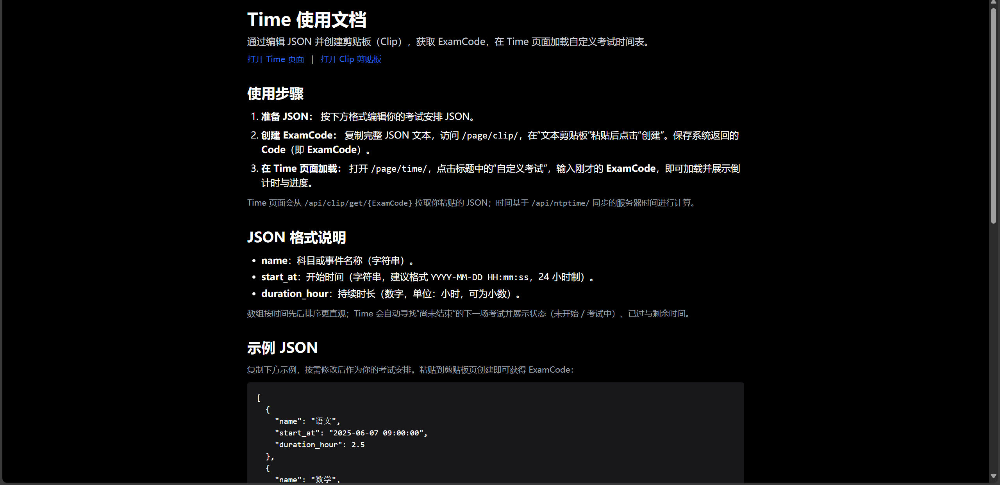

# ClipBox

[](https://www.python.org/)
[](https://flask.palletsprojects.com/)
[](https://github.com/MeTerminator/ClipBox/blob/main/LICENSE)

ClipBox 是一个精致高效的临时文件分享站，类似于 [FileCodeBox](https://github.com/vastsa/FileCodeBox)，支持文件分享、剪贴板分享和短链接功能。同时，它还集成了一个独特的考试时钟功能，可根据文档设置考试科目与时间，并支持 NTP 时间同步。

##  Features

- **文件秒传**: 通过前端和后端双重哈希验证，实现文件快速上传，同时保证数据安全。
- **剪贴板分享**: 支持文本内容的快速分享和跨设备访问。
- **短链接服务**: 可将长链接生成为易于分享的短链接。
- **考试时钟**: 可定制化的考试倒计时时钟，支持 NTP 网络时间同步，确保时间精准。
- **轻量高效**: 基于 Flask 构建，资源占用少，响应迅速。
- **黑色亮色模式切换**: 支持黑色和亮色模式切换，适应不同环境。

##  效果演示

| 首页 | 文件上传 | 文本分享 |
| --- | --- | --- |
|  |  |  |

| 取件码 | 考试时钟 | 时钟文档 |
| --- | --- | --- |
|  |  |  |

##  应用场景

- **临时文件传输**: 在不同设备间快速传输文件，无需登录或安装重量级应用。
- **代码片段分享**: 与同事或朋友分享代码片段、配置文件或日志。
- **在线考试计时**: 为在线考试或模拟测验提供一个精准、统一的网络倒计时时钟。
- **链接临时分享**: 将复杂的长链接转换为简洁的短链接，便于在社交媒体或消息应用中分享。

##  Technical Stack

- **后端**: Flask, Flask-SQLAlchemy
- **数据库**: MySQL (通过 PyMySQL 连接)
- **前端**: 原生 HTML, CSS, JavaScript
- **其他**: NTP

## 快速上手 (Quick Start)

### 环境要求 (Environment Requirements)

  * Python 3.x
  * MySQL

### 本地开发 (Local Development)

1.  **克隆项目**:

    ```bash
    git clone https://github.com/MeTerminator/ClipBox.git
    cd clipbox
    ```

2.  **安装依赖**:

    ```bash
    pip install -r requirements.txt
    ```

3.  **配置应用**:
    - 根据提示修改 `app/config.py` 中的数据库连接信息等配置。

4.  **运行应用**:

    ```bash
    python main.py
    ```

    应用将在 `http://127.0.0.1:5328` 上运行。

## 生产部署 (Deployment Guide)

为了在生产环境中稳定运行，推荐使用 WSGI 服务器进行部署。

### 方案一: Gunicorn (适用于 Linux/macOS)

1.  安装 Gunicorn:

    ```bash
    pip install gunicorn
    ```

2.  运行应用:

    ```bash
    gunicorn -w 4 -b 0.0.0.0:5328 'app:create_app()'
    ```

    - `-w 4`: 启动 4 个工作进程。
    - `-b 0.0.0.0:5328`: 绑定到所有网络接口的 5328 端口。

### 方案二: Waitress (适用于 Windows)

1.  安装 Waitress:

    ```bash
    pip install waitress
    ```

2.  创建 `run.py` 文件:

    ```python
    from waitress import serve
    from app import create_app

    app = create_app()

    if __name__ == '__main__':
        serve(app, host='0.0.0.0', port=5328)
    ```

3.  运行应用:

    ```bash
    python run.py
    ```

## 贡献指南 (Contribution Guide)

我们欢迎任何形式的贡献！

- **报告 Bug**: 如果您发现了 Bug，请通过 [GitHub Issues](https://github.com/MeTerminator/ClipBox/issues) 提交详细信息。
- **功能建议**: 如果您有新功能的想法，也欢迎通过 Issues 提出。
- **代码贡献**: 请遵循以下步骤：
    1. Fork 本仓库。
    2. 创建您的特性分支 (`git checkout -b feature/AmazingFeature`)。
    3. 提交您的更改 (`git commit -m 'Add some AmazingFeature'`)。
    4. 推送到分支 (`git push origin feature/AmazingFeature`)。
    5. 开启一个 Pull Request。

## 许可证 (License)

本项目基于 [MIT License](https://github.com/MeTerminator/ClipBox/blob/main/LICENSE) 开源。

[](https://www.star-history.com/#MeTerminator/ClipBox&Date)

---

- [MeT-Home](https://met6.top/) - MeTerminator's Homepage.
