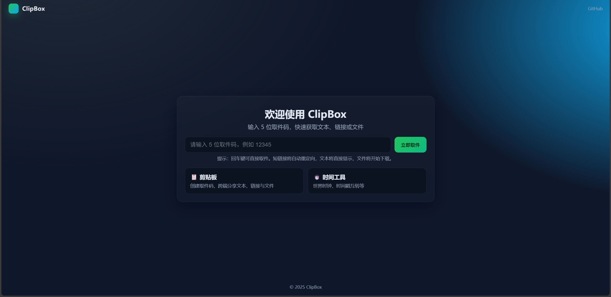
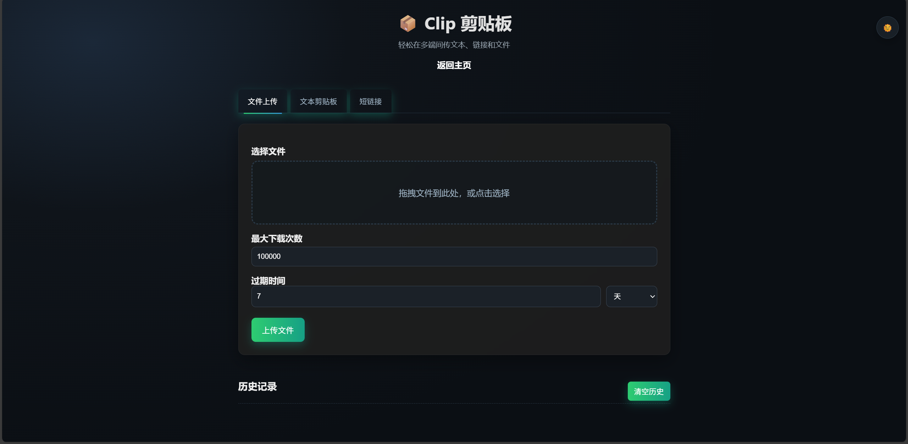
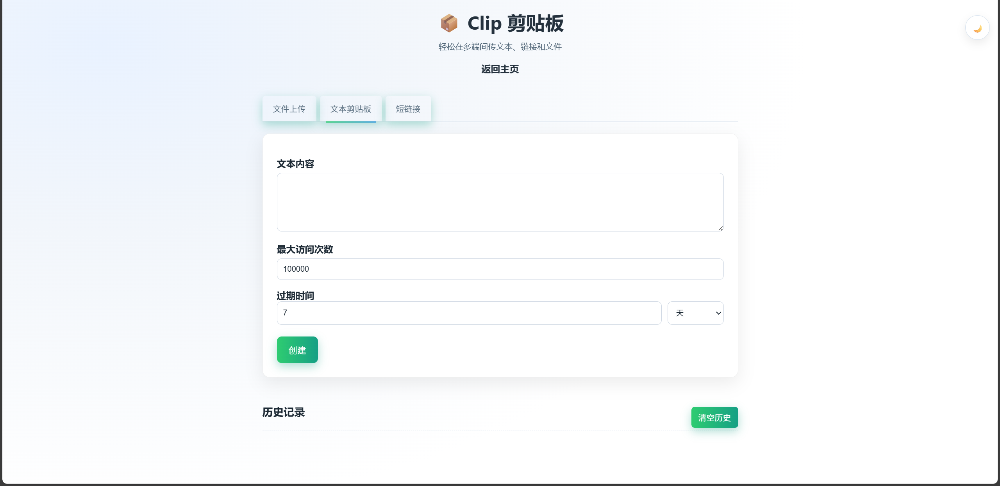
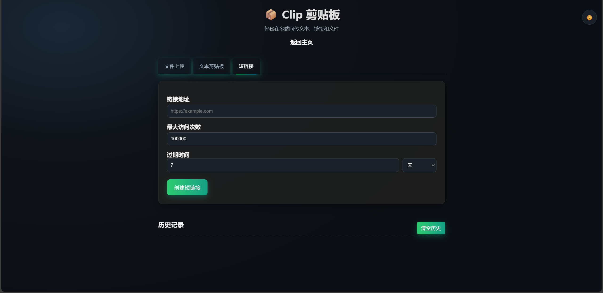
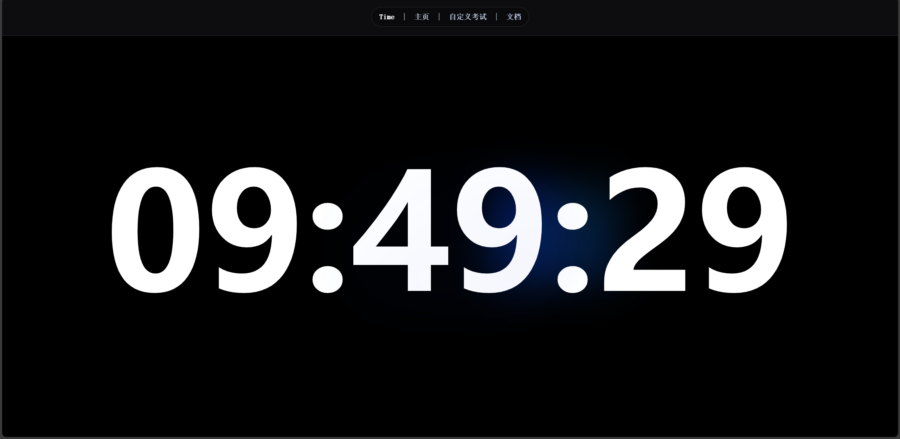
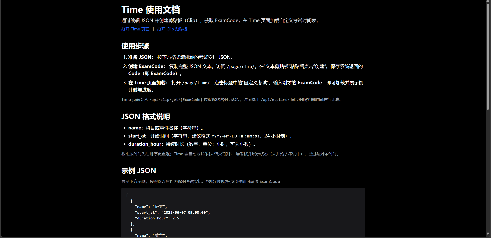

# ClipBox

[English](README_CN.md) | [简体中文](README_CN.md)

[](https://www.python.org/)
[](https://flask.palletsprojects.com/)
[](https://github.com/MeTerminator/ClipBox/blob/main/LICENSE)

ClipBox is an exquisite and efficient temporary file sharing station, similar to [FileCodeBox](https://github.com/vastsa/FileCodeBox), supporting file sharing, clipboard sharing, and short link functionality. Additionally, it integrates a unique **Exam Clock** feature, allowing users to set exam subjects and times based on a configuration document and supporting NTP time synchronization.

## Features

  * **Instant File Transfer**: Achieves rapid file upload through dual hash verification on the frontend and backend, ensuring data security.
  * **Clipboard Sharing**: Supports quick sharing of text content and cross-device access.
  * **Short Link Service**: Can convert long URLs into easy-to-share short links.
  * **Exam Clock**: A customizable exam countdown clock that supports NTP network time synchronization to ensure precise timing.
  * **Lightweight and Efficient**: Built on Flask, it has low resource consumption and fast response times.
  * **Dark/Light Mode Toggle**: Supports switching between dark and light modes to suit different environments.

## Demo

| Home Page | File Upload | Text Sharing |
| --- | --- | --- |
|  |  |  |

| Retrieval Code | Exam Clock | Clock Config Doc |
| --- | --- | --- |
|  |  |  |

## Use Cases

  * **Temporary File Transfer**: Quickly transfer files between different devices without the need to log in or install heavy applications.
  * **Code Snippet Sharing**: Share code snippets, configuration files, or logs with colleagues or friends.
  * **Online Exam Timing**: Provide a precise, unified network countdown clock for online exams or simulated tests.
  * **Temporary Link Sharing**: Convert complex long links into concise short links for easy sharing on social media or messaging apps.

## Technical Stack

  * **Backend**: Flask, Flask-SQLAlchemy
  * **Database**: MySQL (connected via PyMySQL)
  * **Frontend**: Native HTML, CSS, JavaScript
  * **Others**: NTP

## Quick Start

### Environment Requirements

  * Python 3.x
  * MySQL

### Local Development

1.  **Clone the Repository**:

    ```bash
    git clone https://github.com/MeTerminator/ClipBox.git
    cd clipbox
    ```

2.  **Install Dependencies**:

    ```bash
    pip install -r requirements.txt
    ```

3.  **Configure the Application**:

      * Modify the database connection information and other configurations in `app/config.py` as prompted.

4.  **Run the Application**:

    ```bash
    python main.py
    ```

    The application will be running at `http://127.0.0.1:5328`.

## Deployment Guide

For stable operation in a production environment, it is recommended to use a WSGI server for deployment.

### Option 1: Gunicorn (for Linux/macOS)

1.  Install Gunicorn:

    ```bash
    pip install gunicorn
    ```

2.  Run the Application:

    ```bash
    gunicorn -w 4 -b 0.0.0.0:5328 'app:create_app()'
    ```

      * `-w 4`: Starts 4 worker processes.
      * `-b 0.0.0.0:5328`: Binds to port 5328 on all network interfaces.

### Option 2: Waitress (for Windows)

1.  Install Waitress:

    ```bash
    pip install waitress
    ```

2.  Create a `run.py` file:

    ```python
    from waitress import serve
    from app import create_app

    app = create_app()

    if __name__ == '__main__':
        serve(app, host='0.0.0.0', port=5328)
    ```

3.  Run the Application:

    ```bash
    python run.py
    ```

## Contribution Guide

We welcome contributions in any form\!

  * **Report Bugs**: If you find a bug, please submit the details through [GitHub Issues](https://github.com/MeTerminator/ClipBox/issues).
  * **Feature Suggestions**: If you have ideas for new features, feel free to propose them via Issues.
  * **Code Contribution**: Please follow these steps:
    1.  Fork this repository.
    2.  Create your feature branch (`git checkout -b feature/AmazingFeature`).
    3.  Commit your changes (`git commit -m 'Add some AmazingFeature'`).
    4.  Push to the branch (`git push origin feature/AmazingFeature`).
    5.  Open a Pull Request.

## License

This project is open-sourced under the [MIT License](https://github.com/MeTerminator/ClipBox/blob/main/LICENSE).

[](https://www.star-history.com/#MeTerminator/ClipBox&Date)

----

  - [MeT-Home](https://met6.top/) - MeTerminator's Homepage.
