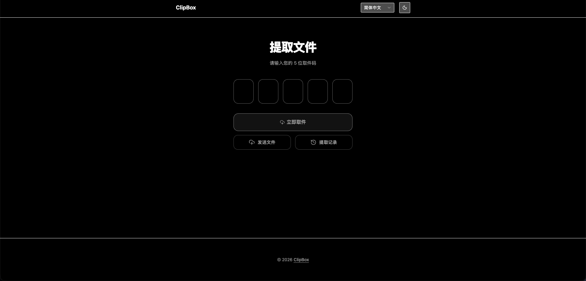
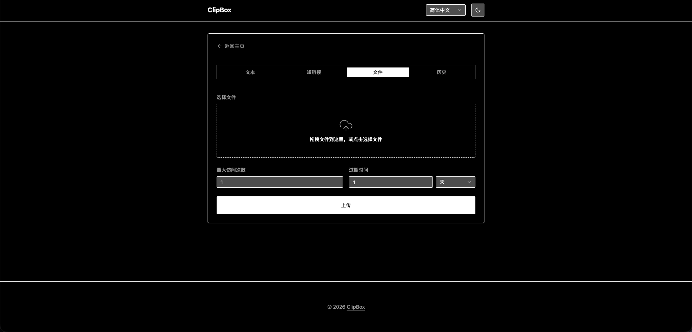
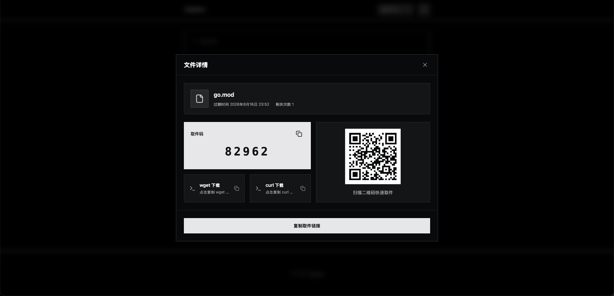
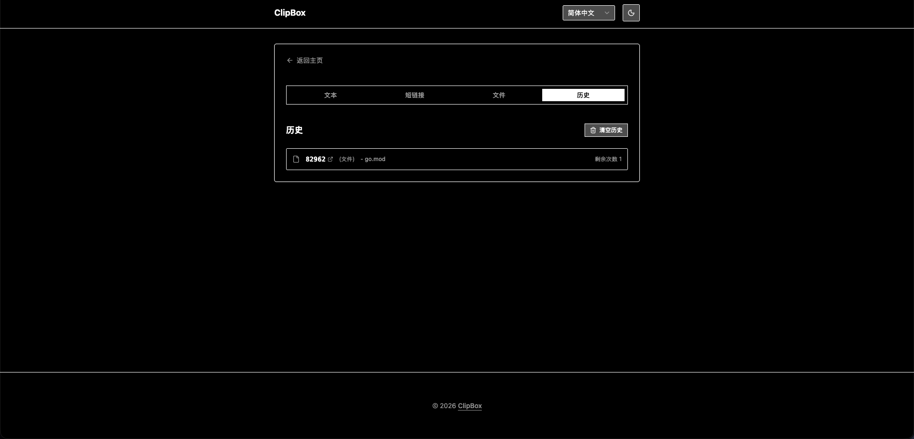

# ClipBox

[English](README.md) | [简体中文](README_CN.md)

[](https://go.dev/)
[](https://gin-gonic.com/)
[](LICENSE)

ClipBox 是一个轻量的临时文件、文本和链接分享服务。用户通过五位取件码获取内容，同时文件和文本拥有基于 SHA1 的稳定直达路径。

## 功能

- 文件取件码会重定向到 `/file/<文件sha1>/<原始文件名>`，该路径也可以直接下载。
- 文本取件码会重定向到 `/text/<文本sha1>`。
- 链接保持原有行为，取件码直接跳转到目标 URL。
- 文件使用多路并发分片上传；未完成分片保存在 `data/tmp/<sha1>`，10 分钟内可恢复进度。
- 服务端合并分片后重新校验完整文件 SHA1，通过后按 `data/files/<原文件名>_<sha1><后缀>` 保存；重复内容会直接复用已有的本地文件。
- 数据库访问基于 GORM；文件元数据由独立的 `cb_files` 表管理，`cb_clips` 通过 `file_id` 关联。
- 新内容默认最多访问 1000 次、1 天后过期；服务端每分钟自动删除过期记录及无引用文件。
- 现有 `cb_clips` 会自动迁移，旧文件记录和缺失的 SHA1 会在启动时回填。
- 分享房间支持多个浏览器交换文本和文件，并以昵称、设备、系统和浏览器展示成员信息。
- 房间消息将载荷 `kind`（`text` / `file`）与来源 `source`（`user` / `clipboard`）分开；桌面客户端仅通过复制/粘贴快捷键同步纯文本。

## 技术栈

- 后端：Go、Gin、GORM、SQLite/MySQL
- 前端：Vue 3、TypeScript、Vite、Tailwind CSS、shadcn-vue
- 存储：`data/` 下的本地内容寻址文件

后端的包职责、依赖方向和数据一致性约束见 [架构说明](docs/ARCHITECTURE.md)；接口细节见 [API 契约](docs/API.md)，参与开发前请阅读 [Go 开发规范](docs/DEVELOPMENT.md)。

## 界面预览

### 取件与发送

<p align="center">
  
</p>

<p align="center">
  
</p>

### 文件详情与发送历史

<p align="center">
  
</p>

<p align="center">
  
</p>

## 快速开始

需要 Go 1.23+ 和 Node.js 20+。默认使用 SQLite，无需预先安装数据库服务。

```bash
cd frontend
npm ci
npm run build
cd ..
go run .
```

首次启动会生成 `data/config.json` 和 SQLite 数据库 `data/clipbox.db`。SQLite 使用纯 Go 驱动，因此 GitHub Actions 打包的 `CGO_ENABLED=0` 二进制也可以直接使用 SQLite。默认监听 `http://127.0.0.1:5328`。前端开发时可在 `frontend/` 中运行 `npm run dev`；Vite 会把 `/clip`、`/file` 和 `/text` 代理到 Go 服务。

## 桌面客户端

客户端使用 Tauri 2，复用系统 WebView，支持 Windows、macOS 和 Linux（X11）。关闭主窗口后会继续驻留系统托盘，点击托盘图标可重新打开。

```bash
cd frontend
npm install
npm run desktop:dev

# 连接远程 ClipBox 服务并生成当前平台安装包
VITE_API_ORIGIN=https://clipbox.example.com npm run desktop:build
```

- Windows/Linux 使用 `Ctrl+C`、`Ctrl+V`，macOS 使用 `Command+C`、`Command+V`。客户端监听按键但不占用系统快捷键。
- 复制快捷键完成后，客户端只在剪贴板是纯文本且当前分享房间在线时上传；右键菜单、应用菜单、脚本或剪贴板历史工具造成的变化不会上传，图片与文件也不会上传。
- 收到的最近一条远端剪贴板文本只缓存在客户端内；按下粘贴快捷键时才写入系统剪贴板，避免仅因收到消息就修改本机剪贴板。
- macOS 首次使用需要在“系统设置 → 隐私与安全性 → 辅助功能”授权。Linux 的全局按键监听依赖 X11；Wayland 出于安全模型限制，当前版本不支持全局快捷键，可在 XWayland/X11 会话使用。
- 不设置 `VITE_API_ORIGIN` 时桌面客户端默认连接 `http://127.0.0.1:5328`。这项值在打包时写入前端，请使用实际 HTTPS 服务地址发布安装包。

客户端的快捷键监听、托盘与粘贴行为需要在三个真实系统上分别验证；单平台编译成功不能替代跨平台安装和权限验证。

## 配置

配置保存在 `data/config.json`。默认数据库配置为：

```json
{
  "database": {
    "driver": "sqlite",
    "dsn": "data/clipbox.db"
  }
}
```

切换 MySQL 时，将 `driver` 改为 `mysql`，并把 `dsn` 设置成 Go MySQL DSN，例如 `root:password@tcp(127.0.0.1:3306)/clipbox?charset=utf8mb4`，然后重启服务。完整配置及默认值会在首次启动时写入文件；环境变量覆盖方式见 [.env.example](.env.example)。

## 分片上传接口

1. `POST /clip/upload/init`，JSON 为 `{filename,size,sha1,count,expire}`，响应包含服务端分片大小、并发数和已上传的分片序号。
2. 使用 `PUT /clip/upload/<sha1>/<分片序号>` 并发上传缺失的原始二进制分片。
3. 使用 `POST /clip/upload/<sha1>/complete` 和 JSON `{filename,count,expire}` 完成上传。

默认分片大小为 4 MiB、并发数为 4、断点保留时间为 10 分钟。可通过 [.env.example](.env.example) 中的环境变量调整。

## 分享房间接口

- `POST /api/rooms` 创建房间，`POST /api/rooms/:roomID/join` 加入房间。
- 房间 ID 为 8 位数字；房间名称可留空，创建者之后可通过 `PATCH /api/rooms/:roomID` 修改。
- 房间是临时的：最后一个 WebSocket 客户端断开后立即删除；从未成功建立连接的遗留房间由后台清理。
- 房间接口使用 `Authorization: Bearer <member-token>`；服务端只保存令牌的 SHA-256 摘要。
- `GET /api/rooms/:roomID/messages?after=<id>` 用于断线重连后恢复已持久化的历史消息。
- `GET /api/rooms/:roomID/ws` 建立实时通道；客户端首帧必须为 `{"type":"auth","token":"..."}`，发送消息使用 `{"type":"send","message":{kind,source,...}}`。
- 文本载荷为 `{kind:"text",source,text}`；文件先复用现有上传接口，再发送 `{kind:"file",source:"user",file_code}`。当前服务端拒绝 `source:"clipboard"` 的非文本消息。
- `DELETE /api/rooms/:roomID` 仅允许房间创建者调用。

## 发布版本

仓库内置了手动触发的 GitHub Actions 工作流 `.github/workflows/release.yml`。在 Actions 页面运行 **Build and Release**，即可构建 Linux、Windows、macOS 的 amd64 和 arm64 版本。每个压缩包都包含对应二进制文件、构建后的 `www/` 前端目录和项目文档。工作流会按上海时区以 `YYMMDD` 格式创建 Release，并附带 `SHA256SUMS` 校验文件。

## 测试

```bash
go test ./...
go vet ./...
cd frontend && npm run typecheck && npm run build
```

## 许可证

[MIT](LICENSE)
