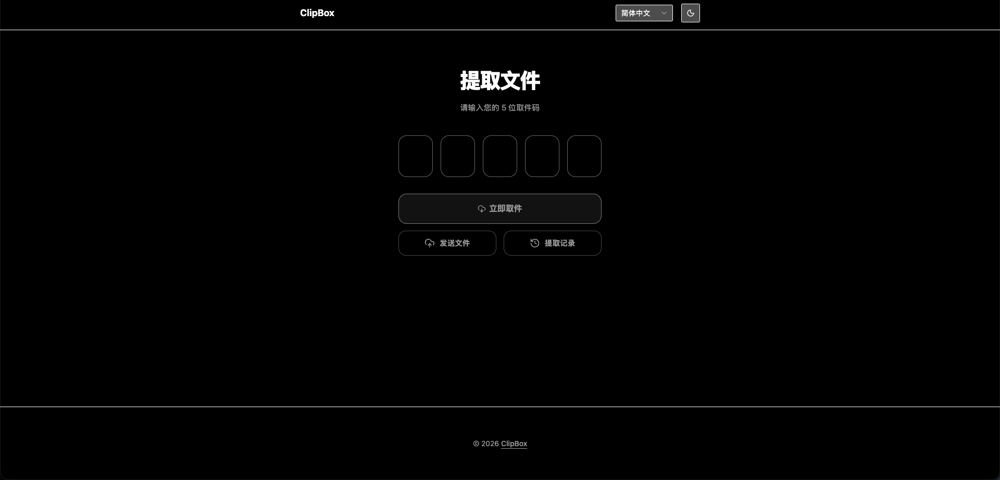
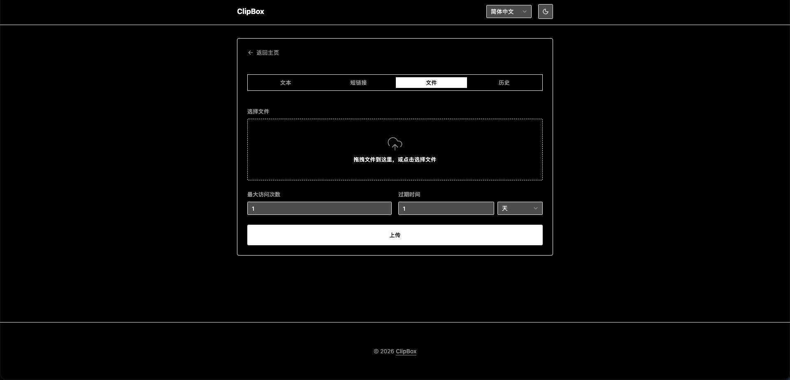
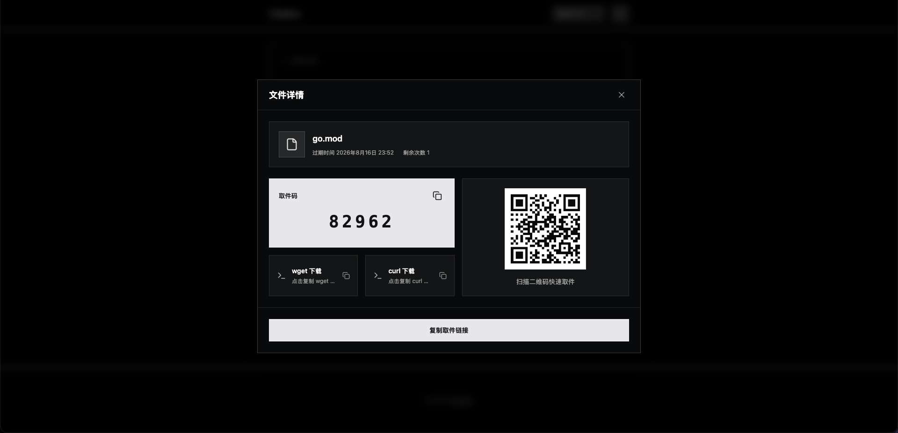
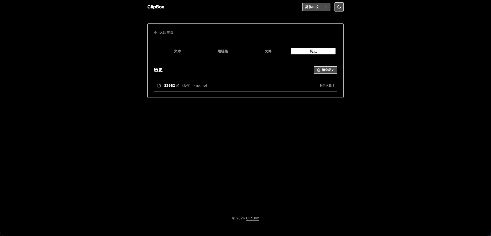

# ClipBox

[English](README.md) | [简体中文](README_CN.md)

[](https://go.dev/)
[](https://gin-gonic.com/)
[](LICENSE)

ClipBox 是一个轻量的临时文件、文本和链接分享服务。用户通过五位取件码获取内容，同时文件和文本拥有基于 SHA1 的稳定直达路径。

## 功能

- 文件取件码会重定向到 `/api/file/<文件sha1>/<原始文件名>`，该路径也可以直接下载。
- 文本取件码会重定向到 `/api/text/<文本sha1>`。
- 链接保持原有行为，取件码直接跳转到目标 URL。
- 文件使用多路并发分片上传；未完成分片保存在 `data/tmp/<sha1>`，10 分钟内可恢复进度。
- 服务端合并分片后重新校验完整文件 SHA1，通过后按 `data/files/<原文件名>_<sha1><后缀>` 保存；重复内容会直接复用已有的本地文件。
- 数据库访问基于 GORM；文件元数据由独立的 `cb_files` 表管理，`cb_clips` 通过 `file_id` 关联。
- 新内容默认最多访问 1000 次、1 天后过期；服务端每分钟自动删除过期记录及无引用文件。
- 现有 `cb_clips` 会自动迁移，旧文件记录和缺失的 SHA1 会在启动时回填。
- 分享房间支持多个浏览器交换文本和文件，并以昵称、设备、系统和浏览器展示成员信息。主页输入框可直接打开取件码或房间 ID；房间会使用随机昵称直接加入，昵称可在加入后修改。
- 房间消息将载荷 `kind`（`text` / `file`）与来源 `source`（`user` / `clipboard`）分开；桌面客户端仅通过复制/粘贴快捷键同步纯文本。

## 技术栈

- 后端：Go、Gin、GORM、SQLite/MySQL
- 前端：Vue 3、TypeScript、Vite、Tailwind CSS、shadcn-vue
- 存储：`data/` 下的本地内容寻址文件

后端的包职责、依赖方向和数据一致性约束见 [架构说明](docs/ARCHITECTURE.md)；接口细节见 [API 契约](docs/API.md)，参与开发前请阅读 [Go 开发规范](docs/DEVELOPMENT.md)。

## 界面预览

### 取件与发送

<p align="center">
  
</p>

<p align="center">
  
</p>

### 文件详情与发送历史

<p align="center">
  
</p>

<p align="center">
  
</p>

## 快速开始

需要 Go 1.23+ 和 Node.js 20+。默认使用 SQLite，无需预先安装数据库服务。

```bash
cd frontend
ppnpm install --frozen-lockfile
pnpm run build
cd ..
go run .
```

前端构建完成后，`go build` 会生成内嵌 `www/` 的独立二进制文件，运行时不再需要单独部署前端目录。首次启动会生成 `data/config.json` 和 SQLite 数据库 `data/clipbox.db`。SQLite 使用纯 Go 驱动，因此 GitHub Actions 打包的 `CGO_ENABLED=0` 二进制也可以直接使用 SQLite。默认监听 `http://127.0.0.1:5328`。前端开发时可在 `frontend/` 中运行 `pnpm run dev`；Vite 会把 `/api/` 代理到 Go 服务。所有后端接口（包括上传、取件、文件/文本下载和房间实时连接）统一使用 `/api/` 前缀。

## 桌面客户端

客户端使用 Tauri 2，复用系统 WebView，支持 Windows、macOS 和 Linux（X11）。客户端以便携版可执行文件分发，不提供安装包。关闭主窗口后会继续驻留系统托盘，点击托盘图标可重新打开。

```bash
cd frontend
pnpm install
pnpm run desktop:dev

# 构建当前平台的便携版可执行文件
VITE_API_ORIGIN=https://clipbox.example.com pnpm run desktop:build
```

构建结果为 `frontend/src-tauri/target/release/ClipBox`（Windows 为 `ClipBox.exe`），不会生成安装包。工作目录固定为可执行文件所在目录，与启动时的路径无关。Windows/Linux 的 WebView 数据、localStorage 和缓存保存在该目录的 `data/` 下；macOS 使用非持久化 WebView，并将 localStorage 保存到 `data/local-storage.json`。进程及其子进程的临时目录设为 `data/tmp/`。请解压到可写目录再运行。Windows 需要系统已有 WebView2 Runtime。桌面客户端收到的房间文件会保存到可执行文件旁的 `downloads/` 目录；如果同名文件已存在，新文件会追加本地时间戳（如 `报告-20261008-153000.pdf`）；同一秒内再次重名还会追加序号，不覆盖原文件。下载失败会清理未完成文件。

- Windows/Linux 使用 `Ctrl+C`、`Ctrl+V`，macOS 使用 `Command+C`、`Command+V`。客户端监听按键但不占用系统快捷键。
- 复制快捷键完成后，客户端只在剪贴板是纯文本且当前分享房间在线时上传；右键菜单、应用菜单、脚本或剪贴板历史工具造成的变化不会上传，图片与文件也不会上传。
- 收到的最近一条远端剪贴板文本只缓存在客户端内；按下粘贴快捷键时才写入系统剪贴板，避免仅因收到消息就修改本机剪贴板。
- macOS 首次使用需要在“系统设置 → 隐私与安全性 → 辅助功能”授权。Linux 的全局按键监听依赖 X11；Wayland 出于安全模型限制，当前版本不支持全局快捷键，可在 XWayland/X11 会话使用。
- 不设置 `VITE_API_ORIGIN` 时桌面客户端默认连接 `http://127.0.0.1:5328`。这项值在打包时写入前端，请使用实际 HTTPS 服务地址发布便携版。

独立 Python 房间测试端见 [scripts/README.md](scripts/README.md)，可加入同一房间、读取/修改共享剪贴板，并实时输出聊天和文件下载 URL。

### macOS 本地测试

需要 Rust/Cargo 和 Xcode Command Line Tools（未安装时运行 `xcode-select --install`）。

终端一，从项目根目录启动后端：

```bash
cd frontend
pnpm install --frozen-lockfile
pnpm run build
cd ..
go run .
```

终端二，从项目根目录启动桌面客户端：

```bash
cd frontend
pnpm run desktop:dev
```

在“系统设置 → 隐私与安全性 → 辅助功能”中授权运行客户端的终端或 ClipBox；如果系统要求输入监控权限，也需授权。授权后完全退出客户端并重新启动，关闭窗口只会隐藏到托盘。

1. 桌面客户端连接本地服务并进入房间，浏览器打开 `http://127.0.0.1:5328` 并加入同一房间。
2. 在文本编辑器连续输入、切换中英文输入法、按住/松开 Command，确认客户端持续运行。
3. 在文本编辑器选择纯文本，按 `Command+C`，确认浏览器房间收到文本；长按 C 不应重复发送。
4. 在浏览器房间发送另一段文本，回到文本编辑器按 `Command+V`，确认粘贴的是收到的文本。
5. 用右键菜单复制文本、复制图片或文件，确认没有自动上传；正常系统快捷键仍可使用。
6. 完全退出开发客户端后，运行 `pnpm run desktop:build`，再运行 `./src-tauri/target/release/ClipBox`，重复上述测试。若发布到远程服务，构建时设置 `VITE_API_ORIGIN`。

开发服务器固定使用 5173 端口。若提示端口被占用，先在此前运行开发服务器的终端按 `Ctrl+C`；可用 `lsof -nP -iTCP:5173 -sTCP:LISTEN` 查找占用进程，再关闭对应开发任务后重试。退出码 143 表示进程收到 SIGTERM，需结合停止操作判断，不等同于键盘监听崩溃。远程服务开发命令为 `VITE_API_ORIGIN=https://box.mett.top:444 pnpm run desktop:dev`，地址无需 Markdown 链接标记。

macOS 键盘监听使用原生 Session 事件 tap，按当前事件的 Command 标志识别快捷键，不在后台线程查询输入法字符。客户端启动时提示辅助功能权限，未授权时自动重试；按粘贴键时先写入房间文本再继续传递按键。诊断日志以 `[clipboard]` 开头：`listener ready` 表示监听启动，`room text cache: ready` 表示缓存了房间文本，`Command+C received` 表示收到复制快捷键，`room text written before key delivery` 表示粘贴前已写入系统剪贴板。

Windows、macOS 和 Linux 客户端均提供小型桌面悬浮窗。悬浮窗可以在桌面上拖动，把文件拖到悬浮窗会立即上传：当前处于房间时上传并发送到该房间，不在房间时创建普通文件分享。一次拖入多个文件会排队上传，并记住拖入时的目标房间；上传期间切换或离开该房间时会提示未发送，不会误发到新房间。悬浮窗默认显示 logo，拖入文件时显示上传图标，计算 SHA1 和上传时仅显示百分比，完成后显示对勾。双击打开主窗口，右键可隐藏，并可从系统托盘重新显示。不在房间时，上传完成会打开主窗口展示取件码。房间页右侧可分别控制当前设备的剪贴板共享和文件自动下载。开启自动下载后，其他成员发送的文件（包括未下载过的历史文件）会保存到便携版 `downloads/` 目录，并按内容指纹去重，重复发送、重连和重启不会重复下载。已下载的文件消息显示文件夹图标，点击可打开文件所在位置；关闭自动下载后，未下载文件可通过原生“另存为”对话框选择保存位置。

## 配置

配置保存在 `data/config.json`。默认数据库配置为：

```json
{
  "database": {
    "driver": "sqlite",
    "dsn": "data/clipbox.db"
  }
}
```

内网/反代部署还可配置：

- `site_url`：浏览器可直连的后端站点地址，例如 `http://10.0.0.20:5328`。留空表示不探测直连地址。
- `upload_direct_first`：默认为 `true`。前端首次访问时请求专用探测接口 `/api/clip/upload/__direct_probe__`；结果保存在浏览器本地，后续访问不再探测。可达时上传请求及文件下载链接使用 `site_url`，不可达时使用当前页面的 NGINX 反代地址。
- `cors_allow_origin`：普通 API 的跨域来源，默认为 `*`；可设为单个来源，例如 `https://frontend.intranet`。上传 API 始终允许跨域，以便前端探测及跨主机上传。

`site_url` 只用于浏览器到 Go 服务的上传直连探测，需使用浏览器可解析且可路由到后端的 HTTP(S) 地址。若页面使用 HTTPS，直连地址也应使用 HTTPS。NGINX 反代模式下仍需将 `/api/` 转发到 Go 服务；直连不可用或浏览器因网络/CORS策略无法访问时，上传会使用该反代路径。

切换 MySQL 时，将 `driver` 改为 `mysql`，并把 `dsn` 设置成 Go MySQL DSN，例如 `root:password@tcp(127.0.0.1:3306)/clipbox?charset=utf8mb4`，然后重启服务。完整配置及默认值会在首次启动时写入文件；环境变量覆盖方式见 [.env.example](.env.example)。

## 分片上传接口

1. `POST /api/clip/upload/init`，JSON 为 `{filename,size,sha1,count,expire}`，响应包含服务端分片大小、并发数和已上传的分片序号。
2. 使用 `PUT /api/clip/upload/<sha1>/<分片序号>` 并发上传缺失的原始二进制分片。
3. 使用 `POST /api/clip/upload/<sha1>/complete` 和 JSON `{filename,count,expire}` 完成上传。

默认分片大小为 4 MiB、并发数为 4、断点保留时间为 10 分钟。可通过 [.env.example](.env.example) 中的环境变量调整。

所有后端请求统一使用 `/api/` 前缀。使用 NGINX 分离部署时，将 `/api/` 代理到 Go 服务，其余请求提供前端静态文件并回退到 `index.html`。上传分片默认 4 MiB，NGINX 的 `client_max_body_size` 需大于单个分片大小；房间 WebSocket 也位于 `/api/rooms/:roomID/ws`。

## 分享房间接口

- `POST /api/rooms` 创建房间，`POST /api/rooms/:roomID/join` 加入房间。
- 房间 ID 为 5 位数字，并与取件码共用命名空间；房间名称可留空，任意成员之后可通过 `PATCH /api/rooms/:roomID` 修改。
- 房间是临时的：最后一个 WebSocket 客户端断开后，消息立即删除，房间文件保留 1 天后清理；从未成功建立连接的遗留房间由后台清理。房主退出但仍有其他成员时，房主身份按加入顺序自动转让。
- 房间接口使用 `Authorization: Bearer <member-token>`；服务端只保存令牌的 SHA-256 摘要。
- `GET /api/rooms/:roomID/messages?after=<id>` 用于断线重连后恢复已持久化的历史消息。
- `GET /api/rooms/:roomID/ws` 建立实时通道；客户端首帧必须为 `{"type":"auth","token":"..."}`，发送消息使用 `{"type":"send","message":{kind,source,...}}`。
- 文本载荷为 `{kind:"text",source,text}`；文件先复用现有上传接口，再发送 `{kind:"file",source:"user",file_code}`。当前服务端拒绝 `source:"clipboard"` 的非文本消息。
- `DELETE /api/rooms/:roomID` 仅允许当前房主调用。

## 发布版本

后端和 Tauri 客户端使用两个独立、手动触发的 GitHub Actions 工作流。在 Actions 页面运行 **Build and Release Backend**（`.github/workflows/release.yml`），即可构建 Linux、Windows、macOS 的 amd64 和 arm64 后端版本。每个压缩包包含一个内嵌 Web 前端的独立二进制文件和项目文档。工作流按上海时区以 `YYMMDD` 格式创建 Release，并附带 `SHA256SUMS` 校验文件；不再构建或等待 Tauri 客户端。

Tauri 客户端通过独立工作流打包：

1. 在仓库 **Settings → Secrets and variables → Actions → Variables** 设置 `CLIPBOX_SERVER_URL` 为客户端需要连接的服务地址。
2. 在 **Actions → Build Tauri Portable Clients → Run workflow** 运行 `.github/workflows/desktop.yml`。可选输入 `version` 指定压缩包版本（默认上海日期 `YYMMDD`），`server_url` 可覆盖仓库变量；地址均未设置时使用 `http://127.0.0.1:5328`。
3. 完成后从运行页面的 Artifacts 下载 `desktop-<平台>-<架构>-portable`，产物保留 14 天。Windows 为 ZIP，macOS/Linux 为 TAR.GZ，名称格式为 `clipbox-client-<版本>-<平台>-<架构>-portable`，随附 SHA-256 校验文件和使用说明。

客户端工作流独立运行，上传便携版压缩包和校验文件作为构建产物；后端 Release 只包含后端包。两个流程均使用 pnpm 冻结锁文件，客户端构建还使用 Cargo `--locked`。Linux 客户端以 Ubuntu 22.04 为构建基线，依赖系统 WebKitGTK/GTK；macOS 客户端未签名/公证。各平台运行要求见 [便携客户端说明](docs/PORTABLE.md)。

## 测试

```bash
go test ./...
go vet ./...
cd frontend && pnpm run typecheck && pnpm run build
cd src-tauri && cargo check
```

## 许可证

[MIT](LICENSE)
